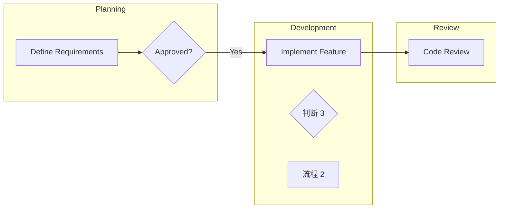

# 1111

```mermaid
graph LR
  subgraph lane_lane_1["Planning"]
    t_task_1["Define Requirements"]
    t_task_2{"Approved?"}
  end
  subgraph lane_lane_2["Development"]
    t_task_3["Implement Feature"]
    t_288b81bb_5983_4dd7_b060_7880e81beab4{"判断 3"}
    t_113a10d4_b994_4d3d_9dc2_eeb89ee88102["流程 2"]
  end
  subgraph lane_lane_3["Review"]
    t_task_4["Code Review"]
  end
  t_task_1 --> t_task_2
  t_task_2 -->|"Yes"| t_task_3
  t_task_3 --> t_task_4

```
