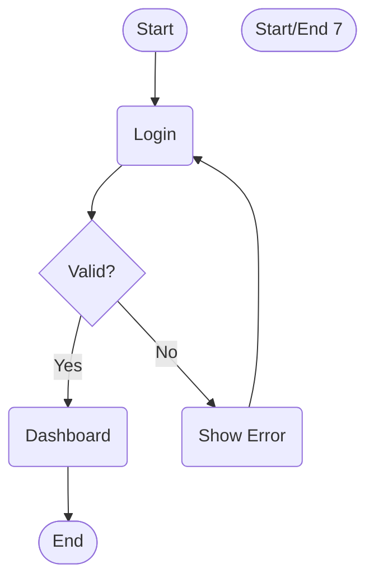

# 123123

```mermaid
flowchart TD
  n_0(["Start"])
  n_1("Login")
  n_2{"Valid?"}
  n_3("Dashboard")
  n_4("Show Error")
  n_5(["End"])
  n_6(["Start/End 7"])
  n_0 --> n_1
  n_1 --> n_2
  n_2 -->|"Yes"| n_3
  n_2 -->|"No"| n_4
  n_4 --> n_1
  n_3 --> n_5

```
