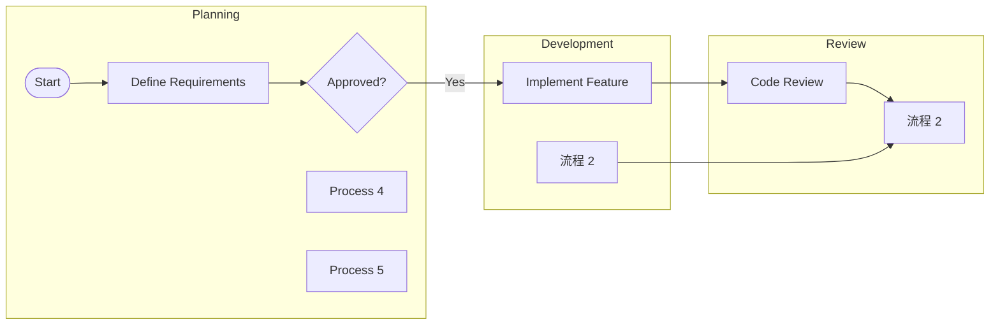

# 12323

```mermaid
flowchart LR
  subgraph lane_0["Planning"]
    t_0{"Approved?"}
    t_1(["Start"])
    t_2["Define Requirements"]
    t_3["Process 4"]
    t_4["Process 5"]
  end
  subgraph lane_1["Development"]
    t_5["Implement Feature"]
    t_6["流程 2"]
  end
  subgraph lane_2["Review"]
    t_7["Code Review"]
    t_8["流程 2"]
  end
  t_1 --> t_2
  t_2 --> t_0
  t_0 -->|"Yes"| t_5
  t_5 --> t_7
  t_7 --> t_8
  t_6 --> t_8

```
