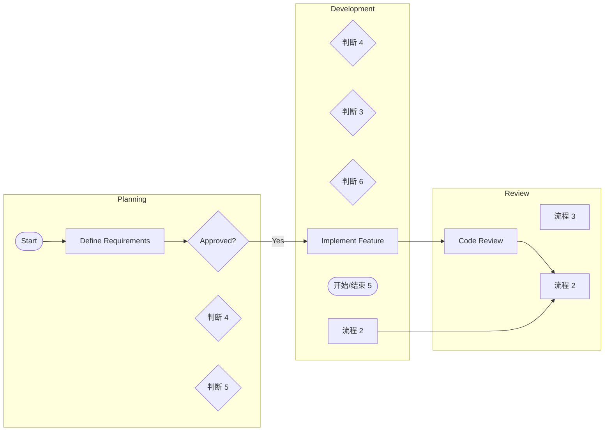

# 12323

```mermaid
flowchart LR
  subgraph lane_0["Planning"]
    t_0{"Approved?"}
    t_1(["Start"])
    t_2["Define Requirements"]
    t_3{"判断 4"}
    t_4{"判断 5"}
  end
  subgraph lane_1["Development"]
    t_5{"判断 4"}
    t_6{"判断 3"}
    t_7{"判断 6"}
    t_8["Implement Feature"]
    t_9(["开始/结束 5"])
    t_10["流程 2"]
  end
  subgraph lane_2["Review"]
    t_11["Code Review"]
    t_12["流程 3"]
    t_13["流程 2"]
  end
  t_1 --> t_2
  t_2 --> t_0
  t_0 -->|"Yes"| t_8
  t_8 --> t_11
  t_11 --> t_13
  t_10 --> t_13

```
