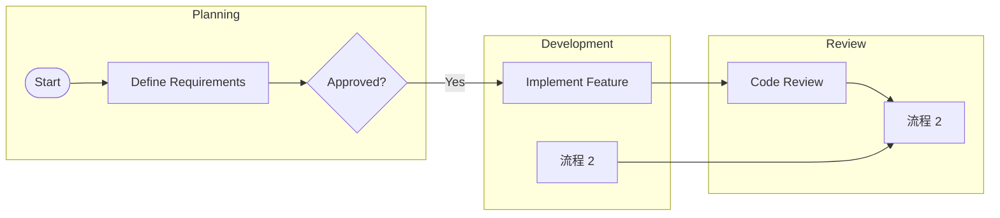

# 12323

```mermaid
flowchart LR
  subgraph lane_0["Planning"]
    t_0{"Approved?"}
    t_1(["Start"])
    t_2["Define Requirements"]
  end
  subgraph lane_1["Development"]
    t_3["Implement Feature"]
    t_4["流程 2"]
  end
  subgraph lane_2["Review"]
    t_5["Code Review"]
    t_6["流程 2"]
  end
  t_1 --> t_2
  t_2 --> t_0
  t_0 -->|"Yes"| t_3
  t_3 --> t_5
  t_5 --> t_6
  t_4 --> t_6

```
