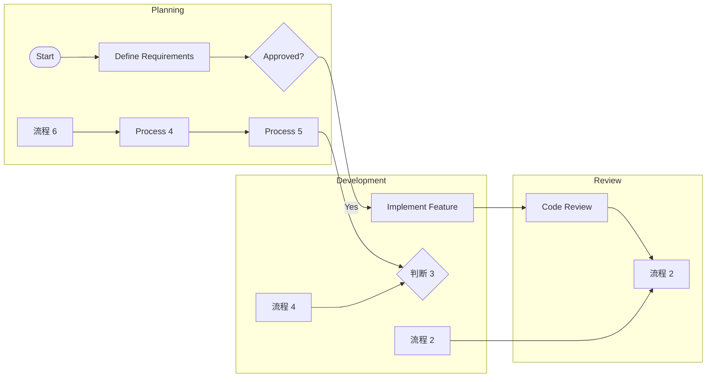

# 12323

```mermaid
flowchart LR
  subgraph lane_0["Planning"]
    t_0{"Approved?"}
    t_1(["Start"])
    t_2["Define Requirements"]
    t_3["流程 6"]
    t_4["Process 4"]
    t_5["Process 5"]
  end
  subgraph lane_1["Development"]
    t_6["流程 4"]
    t_7["Implement Feature"]
    t_8{"判断 3"}
    t_9["流程 2"]
  end
  subgraph lane_2["Review"]
    t_10["Code Review"]
    t_11["流程 2"]
  end
  t_1 --> t_2
  t_2 --> t_0
  t_0 -->|"Yes"| t_7
  t_7 --> t_10
  t_10 --> t_11
  t_9 --> t_11
  t_3 --> t_4
  t_4 --> t_5
  t_5 --> t_8
  t_6 --> t_8

```
