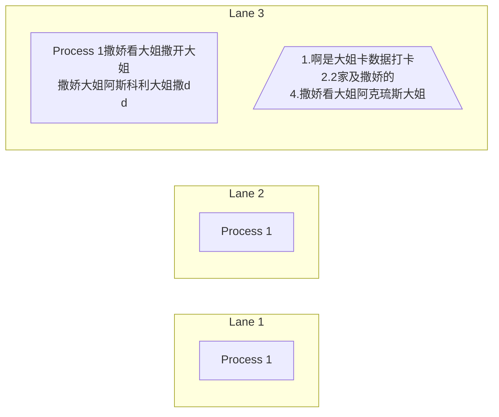

# 1234

```mermaid
flowchart LR
  subgraph lane_0["Lane 1"]
    t_0["Process 1"]
  end
  subgraph lane_1["Lane 2"]
    t_1["Process 1"]
  end
  subgraph lane_2["Lane 3"]
    t_2["Process 1撒娇看大姐撒开大姐<br/>撒娇大姐阿斯科利大姐撒d<br/>d"]
    t_3[/"1.啊是大姐卡数据打卡<br/>2.2家及撒娇的<br/>4.撒娇看大姐阿克琉斯大姐"\]
  end

```
