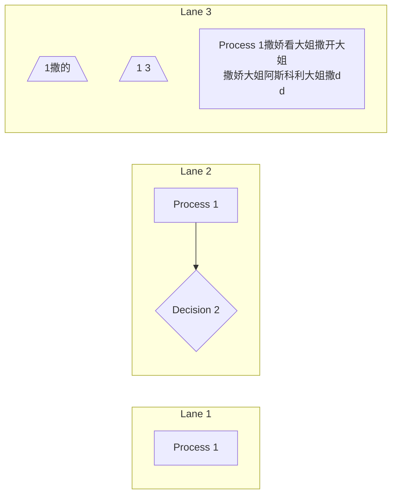

# 1234

```mermaid
flowchart LR
  subgraph lane_0["Lane 1"]
    t_0["Process 1"]
  end
  subgraph lane_1["Lane 2"]
    t_1["Process 1"]
    t_2{"Decision 2"}
  end
  subgraph lane_2["Lane 3"]
    t_3[/"1撒的"\]
    t_4[/"1 3"\]
    t_5["Process 1撒娇看大姐撒开大姐<br/>撒娇大姐阿斯科利大姐撒d<br/>d"]
  end
  t_1 --> t_2

```
