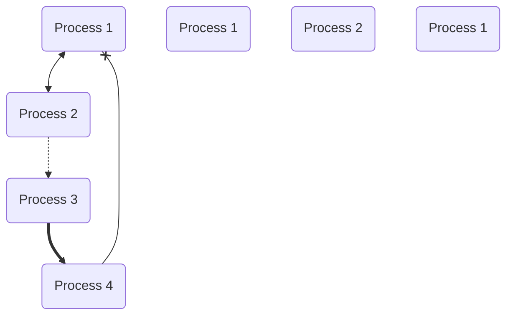

# 123

```mermaid
flowchart TD
  n_0("Process 1")
  n_1("Process 2")
  n_2("Process 3")
  n_3("Process 4")
  n_4("Process 1")
  n_5("Process 2")
  n_6("Process 1")
  n_0 <--> n_1
  n_1 -.-> n_2
  n_2 ==> n_3
  n_3 --x n_0

```
