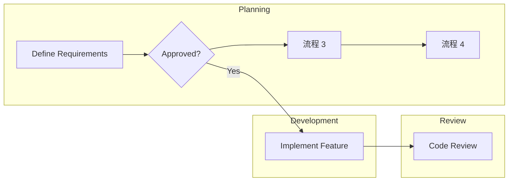

# 123

```mermaid
graph LR
  subgraph lane_lane_1["Planning"]
    t_task_1["Define Requirements"]
    t_task_2{"Approved?"}
    t_31e302ca_089e_4d04_9e8d_91f1c6d83139["流程 3"]
    t_e7024f4d_27f2_4b01_814d_3c43a06c5e19["流程 4"]
  end
  subgraph lane_lane_2["Development"]
    t_task_3["Implement Feature"]
  end
  subgraph lane_lane_3["Review"]
    t_task_4["Code Review"]
  end
  t_task_1 --> t_task_2
  t_task_2 -->|"Yes"| t_task_3
  t_task_3 --> t_task_4
  t_task_2 --> t_31e302ca_089e_4d04_9e8d_91f1c6d83139
  t_31e302ca_089e_4d04_9e8d_91f1c6d83139 --> t_e7024f4d_27f2_4b01_814d_3c43a06c5e19

```
