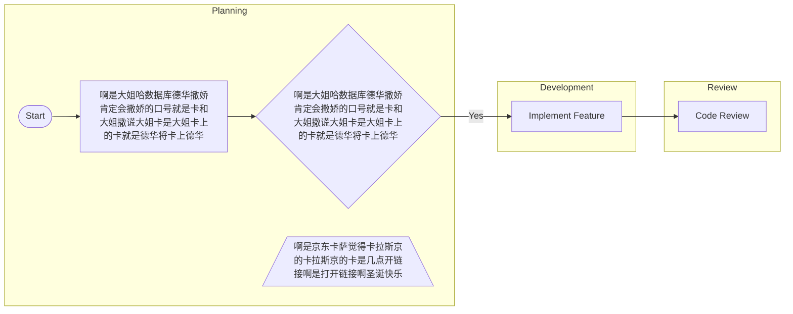

# 123

```mermaid
graph LR
  subgraph lane_lane_1["Planning"]
    t_task_3{"啊是大姐哈数据库德华撒娇肯定会撒娇的口号就是卡和大姐撒谎大姐卡是大姐卡上的卡就是德华将卡上德华"}
    t_task_1(["Start"])
    t_task_2["啊是大姐哈数据库德华撒娇肯定会撒娇的口号就是卡和大姐撒谎大姐卡是大姐卡上的卡就是德华将卡上德华"]
    t_3b0a816f_fc01_4e1f_80a8_30666a077d6d[/"啊是京东卡萨觉得卡拉斯京的卡拉斯京的卡是几点开链接啊是打开链接啊圣诞快乐"\]
  end
  subgraph lane_lane_2["Development"]
    t_task_4["Implement Feature"]
  end
  subgraph lane_lane_3["Review"]
    t_task_5["Code Review"]
  end
  t_task_1 --> t_task_2
  t_task_2 --> t_task_3
  t_task_3 -->|"Yes"| t_task_4
  t_task_4 --> t_task_5

```
