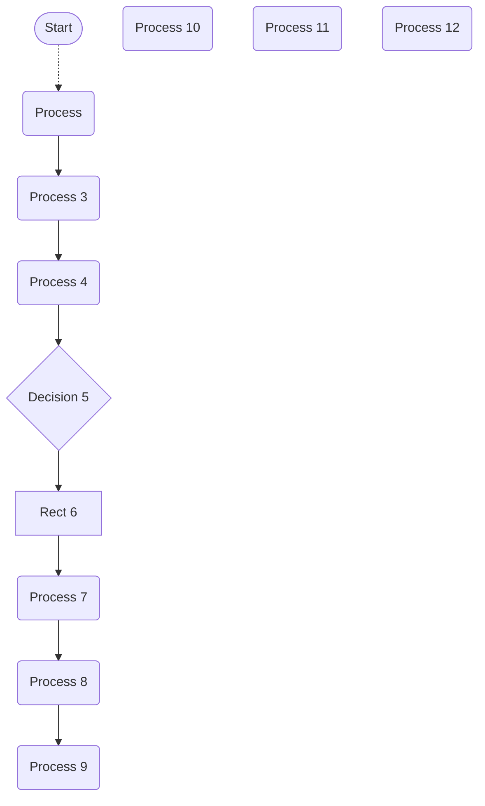

# 123

```mermaid
flowchart TD
  start(["Start"])
  1("Process")
  ed94df6d-27dc-4558-9ba9-f402a2bbd445("Process 3")
  4c29f9f7-41e0-4e52-b326-42d15d39ecab("Process 4")
  33c70f05-26ac-413f-9084-9897f34cde42{"Decision 5"}
  13be37cb-02f9-4296-a578-43674937a2bd["Rect 6"]
  85e9cd21-9674-4376-9826-7df01b6ef5a0("Process 7")
  1a296bdf-a37f-447c-bfb4-0e0b6ec00ac6("Process 8")
  747f80f0-57ab-4e5e-aa6a-257f7eb3cf52("Process 9")
  06ec0340-97f1-436f-877c-59391d71ad22("Process 10")
  17a31538-272a-4913-9b74-d8e41456a13a("Process 11")
  2a96f7a1-b4d1-4adb-a90c-5574100b23c6("Process 12")
  start -.-> 1
  1 --> ed94df6d-27dc-4558-9ba9-f402a2bbd445
  ed94df6d-27dc-4558-9ba9-f402a2bbd445 --> 4c29f9f7-41e0-4e52-b326-42d15d39ecab
  4c29f9f7-41e0-4e52-b326-42d15d39ecab --> 33c70f05-26ac-413f-9084-9897f34cde42
  33c70f05-26ac-413f-9084-9897f34cde42 --> 13be37cb-02f9-4296-a578-43674937a2bd
  13be37cb-02f9-4296-a578-43674937a2bd --> 85e9cd21-9674-4376-9826-7df01b6ef5a0
  85e9cd21-9674-4376-9826-7df01b6ef5a0 --> 1a296bdf-a37f-447c-bfb4-0e0b6ec00ac6
  1a296bdf-a37f-447c-bfb4-0e0b6ec00ac6 --> 747f80f0-57ab-4e5e-aa6a-257f7eb3cf52

```
