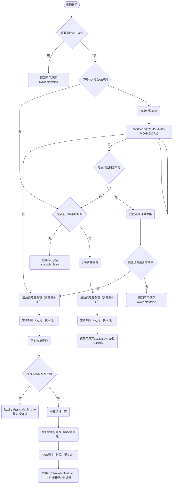

# 123

```mermaid
flowchart TD
  n_0(["查询报价"])
  n_1{"是否有大板取价规则"}
  n_2{"是否有小板取价规则"}
  n_3("大板线路查询")
  n_4("增加保障服务费（客配置中的）")
  n_5("加价规则（利润、税率等）")
  n_6("得到大板报价")
  n_7{"是否有小板取价规则"}
  n_8("返回不可承运available=false")
  n_9("增加保障服务费（客配置中的）")
  n_10("小板价格计算")
  n_11("加价规则（利润、税率等）")
  n_12("返回可承运available=true和小板价格")
  n_13("返回可承运available=true<br/>和大板价格")
  n_14("增加保障服务费（客配置中的）")
  n_15("小板价格计算")
  n_16("加价规则（利润、税率等）")
  n_17("返回可承运available=true、大板价格和小板价格")
  n_18("兜底策略计算价格")
  n_19{"是否开启兜底策略"}
  n_20("返回不可承运available=false")
  n_21{"渠道是否命中规则"}
  n_22{"兜底价格是否有结果"}
  n_23("返回不可承运available=false")
  n_1 -->|"否"| n_2
  n_1 --> n_3
  n_3 --> 8b800e05-fd75-45dd-aff6-746e3c9b27a5
  8b800e05-fd75-45dd-aff6-746e3c9b27a5 -->|"是"| n_4
  n_4 --> n_5
  n_5 --> n_6
  n_6 --> n_7
  n_2 -->|"否"| n_8
  n_2 -->|"是"| n_10
  n_10 --> n_9
  n_9 --> n_11
  n_11 --> n_12
  n_15 --> n_14
  n_14 --> n_16
  n_16 --> n_17
  n_7 -->|"否"| n_13
  n_7 -->|"是"| n_15
  8b800e05-fd75-45dd-aff6-746e3c9b27a5 -->|"否"| n_19
  n_19 -->|"是"| n_18
  n_19 -->|"否"| n_2
  n_0 --> n_21
  n_21 -->|"否"| n_20
  n_21 -->|"是"| n_1
  n_22 -->|"是"| n_4
  n_18 --> n_22
  n_22 -->|"否"| n_23
  8b800e05-fd75-45dd-aff6-746e3c9b27a5 --> 8b800e05-fd75-45dd-aff6-746e3c9b27a5

```
