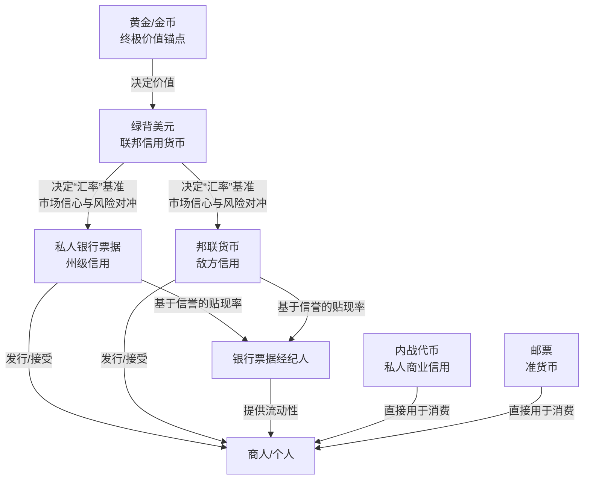

# 123

```mermaid
flowchart TD
  n_0["黄金/金币<br>终极价值锚点"]
  n_1["绿背美元<br>联邦信用货币"]
  n_2["私人银行票据<br>州级信用"]
  n_3["邦联货币<br>敌方信用"]
  n_4["商人/个人"]
  n_5["银行票据经纪人"]
  n_6["内战代币<br>私人商业信用"]
  n_7["邮票<br>准货币"]
  n_0 -->|"决定价值"| n_1
  n_1 -->|"决定“汇率”基准<br>市场信心与风险对冲"| n_2
  n_1 -->|"决定“汇率”基准<br>市场信心与风险对冲"| n_3
  n_2 -->|"发行/接受"| n_4
  n_3 -->|"发行/接受"| n_4
  n_2 -->|"基于信誉的贴现率"| n_5
  n_3 -->|"基于信誉的贴现率"| n_5
  n_5 -->|"提供流动性"| n_4
  n_6 -->|"直接用于消费"| n_4
  n_7 -->|"直接用于消费"| n_4

```
