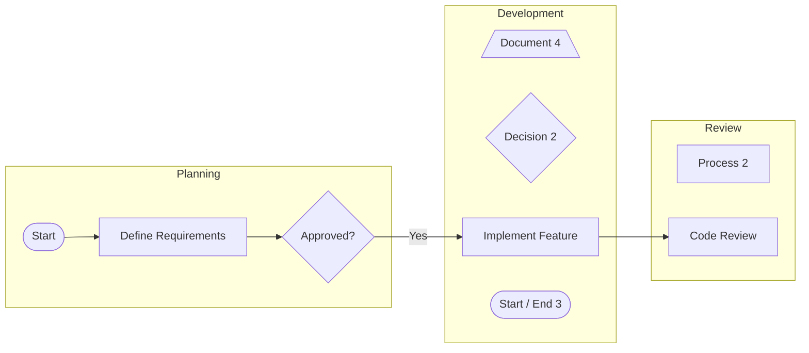

# 123

```mermaid
flowchart LR
  subgraph lane_0["Planning"]
    t_0{"Approved?"}
    t_1["Define Requirements"]
    t_2(["Start"])
  end
  subgraph lane_1["Development"]
    t_3[/"Document 4"\]
    t_4{"Decision 2"}
    t_5["Implement Feature"]
    t_6(["Start / End 3"])
  end
  subgraph lane_2["Review"]
    t_7["Process 2"]
    t_8["Code Review"]
  end
  t_0 -->|"Yes"| t_5
  t_5 --> t_8
  t_2 --> t_1
  t_1 --> t_0

```
