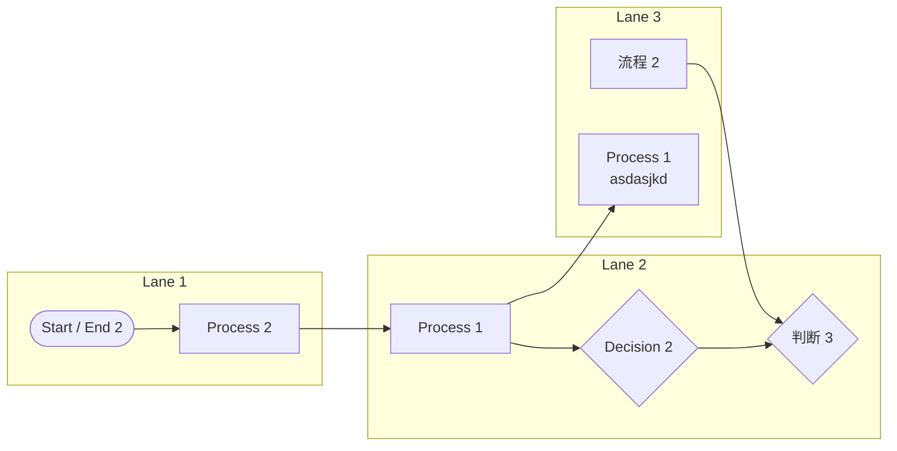

# 123

```mermaid
flowchart LR
  subgraph lane_0["Lane 1"]
    t_0["Process 2"]
    t_1(["Start / End 2"])
  end
  subgraph lane_1["Lane 2"]
    t_2{"Decision 2"}
    %% [tag:existing] 已有 | 阿斯顿撒娇看了大姐撒开
    t_3["Process 1"]
    t_4{"判断 3"}
  end
  subgraph lane_2["Lane 3"]
    t_5["流程 2"]
    t_6["Process 1<br/>asdasjkd"]
    %% [tag:other] 其他 | 2为企鹅12312321
  end
  t_1 --> t_0
  t_0 --> t_3
  t_3 --> t_2
  t_3 --> t_6
  t_5 --> t_4
  t_2 --> t_4

```
