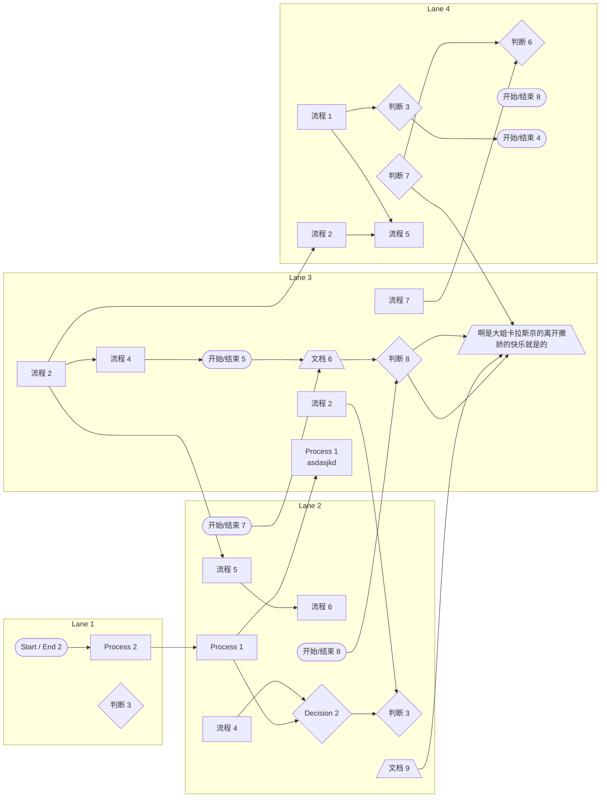

# 123

```mermaid
flowchart LR
  subgraph lane_0["Lane 1"]
    t_0["Process 2"]
    t_1{"判断 3"}
    t_2(["Start / End 2"])
  end
  subgraph lane_1["Lane 2"]
    t_3["流程 4"]
    t_4["流程 6"]
    t_5["流程 5"]
    t_6(["开始/结束 7"])
    t_7{"判断 3"}
    t_8{"Decision 2"}
    %% [tag:pending] 待确认 | 阿斯顿撒娇看了大姐撒开
    t_9["Process 1"]
    t_10(["开始/结束 8"])
    t_11[/"文档 9"\]
  end
  subgraph lane_2["Lane 3"]
    t_12(["开始/结束 5"])
    t_13["流程 2"]
    t_14["流程 2"]
    t_15{"判断 8"}
    t_16[/"文档 6"\]
    t_17[/"啊是大姐卡拉斯京的离开撒娇的快乐就是的"\]
    t_18["流程 4"]
    t_19["Process 1<br/>asdasjkd"]
    %% [tag:other] 其他 | 2为企鹅12312321
    t_20["流程 7"]
  end
  subgraph lane_3["Lane 4"]
    t_21["流程 2"]
    t_22{"判断 7"}
    t_23["流程 1"]
    t_24{"判断 3"}
    t_25{"判断 6"}
    t_26(["开始/结束 8"])
    t_27(["开始/结束 4"])
    t_28["流程 5"]
  end
  t_2 --> t_0
  t_0 --> t_9
  t_9 --> t_8
  t_9 --> t_19
  t_14 --> t_7
  t_8 --> t_7
  t_3 --> t_8
  t_5 --> t_4
  t_13 --> t_18
  t_18 --> t_12
  t_13 --> t_5
  t_13 --> t_21
  t_21 --> t_28
  t_23 --> t_28
  t_23 --> t_24
  t_24 --> t_27
  t_20 --> t_25
  t_22 --> t_25
  t_22 --> t_17
  t_15 --> t_17
  t_16 --> t_15
  t_12 --> t_16
  t_6 --> t_16
  t_10 --> t_15
  t_11 --> t_17
  t_15 --> t_17

```
