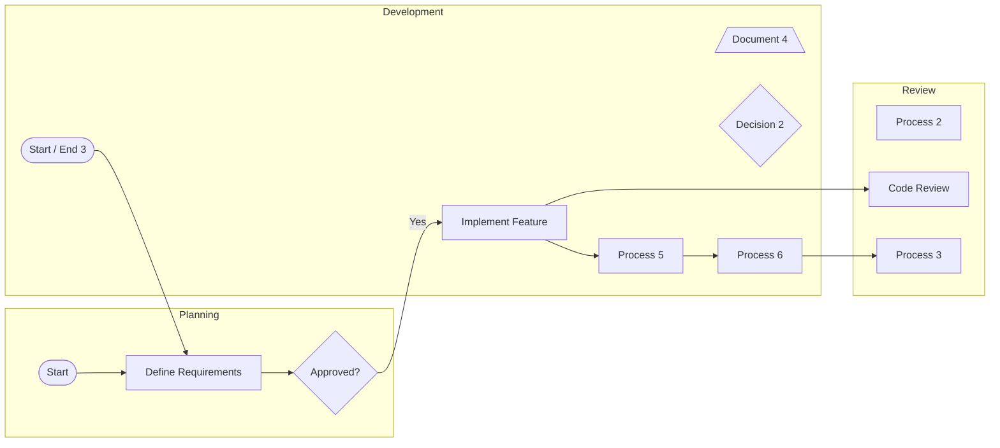

# 123

```mermaid
flowchart LR
  subgraph lane_0["Planning"]
    t_0{"Approved?"}
    t_1["Define Requirements"]
    t_2(["Start"])
  end
  subgraph lane_1["Development"]
    t_3[/"Document 4"\]
    t_4{"Decision 2"}
    t_5(["Start / End 3"])
    t_6["Process 5"]
    t_7["Implement Feature"]
    t_8["Process 6"]
  end
  subgraph lane_2["Review"]
    t_9["Process 2"]
    t_10["Code Review"]
    t_11["Process 3"]
  end
  t_0 -->|"Yes"| t_7
  t_7 --> t_10
  t_2 --> t_1
  t_1 --> t_0
  t_5 --> t_1
  t_7 --> t_6
  t_6 --> t_8
  t_8 --> t_11

```
