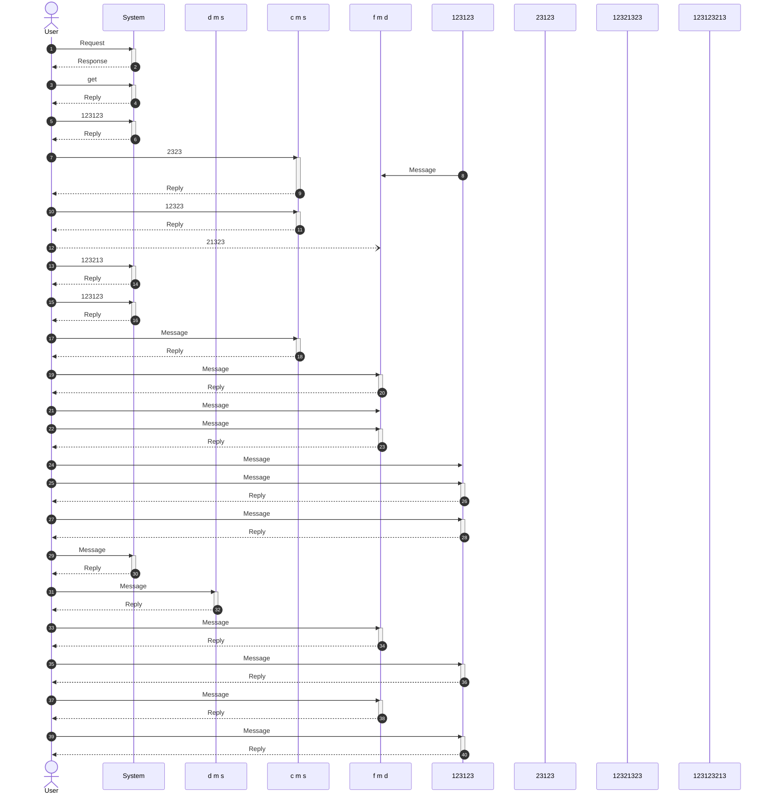

# 123

```mermaid
sequenceDiagram
  autonumber
  actor p0 as User
  participant p1 as System
  participant p2 as d m s
  participant p3 as c m s
  participant p4 as f m d
  participant p5 as 123123
  participant p6 as 23123
  participant p7 as 12321323
  participant p8 as 123123213
  p0->>p1: Request
  activate p1
  p1-->>p0: Response
  deactivate p1
  p0->>p1: get
  activate p1
  p1-->>p0: Reply
  deactivate p1
  p0->>p1: 123123
  activate p1
  p1-->>p0: Reply
  deactivate p1
  p0->>p3: 2323
  activate p3
  p5->>p4: Message
  p3-->>p0: Reply
  deactivate p3
  p0->>p3: 12323
  activate p3
  p3-->>p0: Reply
  deactivate p3
  p0--)p4: 21323
  p0->>p1: 123213
  activate p1
  p1-->>p0: Reply
  deactivate p1
  p0->>p1: 123123
  activate p1
  p1-->>p0: Reply
  deactivate p1
  p0->>p3: Message
  activate p3
  p3-->>p0: Reply
  deactivate p3
  p0->>p4: Message
  activate p4
  p4-->>p0: Reply
  deactivate p4
  p0->>p4: Message
  p0->>p4: Message
  activate p4
  p4-->>p0: Reply
  deactivate p4
  p0->>p5: Message
  p0->>p5: Message
  activate p5
  p5-->>p0: Reply
  deactivate p5
  p0->>p5: Message
  activate p5
  p5-->>p0: Reply
  deactivate p5
  p0->>p1: Message
  activate p1
  p1-->>p0: Reply
  deactivate p1
  p0->>p2: Message
  activate p2
  p2-->>p0: Reply
  deactivate p2
  p0->>p4: Message
  activate p4
  p4-->>p0: Reply
  deactivate p4
  p0->>p5: Message
  activate p5
  p5-->>p0: Reply
  deactivate p5
  p0->>p4: Message
  activate p4
  p4-->>p0: Reply
  deactivate p4
  p0->>p5: Message
  activate p5
  p5-->>p0: Reply
  deactivate p5

  %% Links
  %% [接口1] http://www.baidu.com (used in: get)
  %% [接口222] https://www.google.com (used in: 12323)

```
