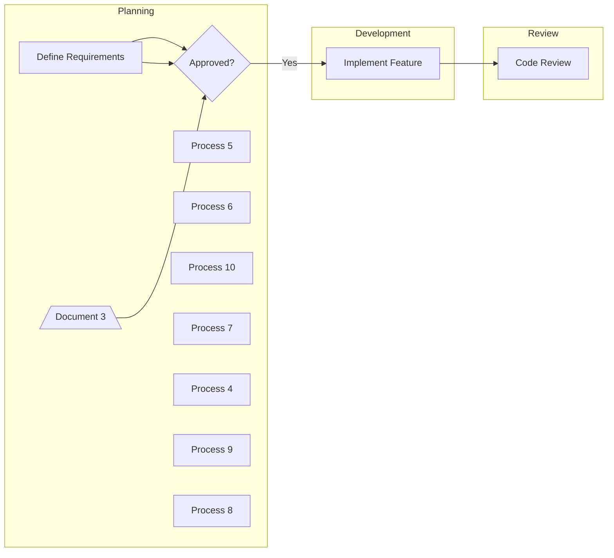

# 123

```mermaid
graph LR
  subgraph lane_lane_2["Development"]
    t_task_3["Implement Feature"]
  end
  subgraph lane_lane_1["Planning"]
    t_task_1["Define Requirements"]
    t_task_2{"Approved?"}
    t_83d23f42_fcdf_4d59_99a8_0b1577cb1d8b["Process 5"]
    t_fd98ccdd_eadf_4019_b7b0_028227e9435c["Process 6"]
    t_69f290e6_49fe_4997_a1c0_d3876c8f9e58[/"Document 3"\]
    t_d79b1747_db95_470a_96c2_e47dd4144b9b["Process 10"]
    t_f4269c14_ed96_4562_9fe2_0f971517948b["Process 7"]
    t_b7e05607_050d_42ed_8f8a_76b35820d277["Process 4"]
    t_2ac99c38_e696_4853_a47d_a35b97ec865d["Process 9"]
    t_3cf13b7f_7c3b_4424_9c24_b800ccfa169f["Process 8"]
  end
  subgraph lane_lane_3["Review"]
    t_task_4["Code Review"]
  end
  t_task_1 --> t_task_2
  t_task_2 -->|"Yes"| t_task_3
  t_task_3 --> t_task_4
  t_69f290e6_49fe_4997_a1c0_d3876c8f9e58 --> t_task_2
  t_task_1 --> t_task_2

```
