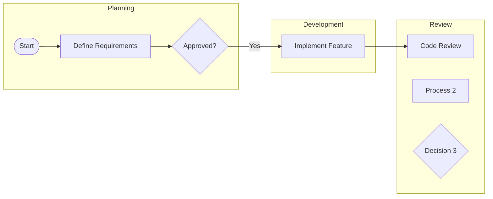

# 123

```mermaid
graph LR
  subgraph lane_lane_1["Planning"]
    t_task_3{"Approved?"}
    t_task_1(["Start"])
    t_task_2["Define Requirements"]
  end
  subgraph lane_lane_2["Development"]
    t_task_4["Implement Feature"]
  end
  subgraph lane_lane_3["Review"]
    t_task_5["Code Review"]
    t_f878443c_fb42_4e7b_9ed5_04e5d1d848d1["Process 2"]
    t_b37941da_d4bf_4f20_8d84_af6f34391525{"Decision 3"}
  end
  t_task_1 --> t_task_2
  t_task_2 --> t_task_3
  t_task_3 -->|"Yes"| t_task_4
  t_task_4 --> t_task_5

```
