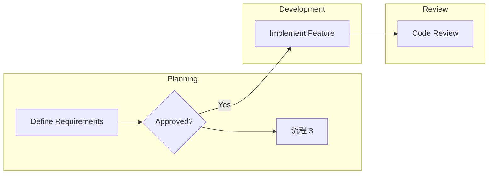

# 123

```mermaid
graph LR
  subgraph lane_lane_1["Planning"]
    t_task_2{"Approved?"}
    t_task_1["Define Requirements"]
    t_3d4d3c03_8ba1_4aec_83b1_1abf996d96d6["流程 3"]
  end
  subgraph lane_lane_2["Development"]
    t_task_3["Implement Feature"]
  end
  subgraph lane_lane_3["Review"]
    t_task_4["Code Review"]
  end
  t_task_1 --> t_task_2
  t_task_2 -->|"Yes"| t_task_3
  t_task_3 --> t_task_4
  t_task_2 --> t_3d4d3c03_8ba1_4aec_83b1_1abf996d96d6

```
