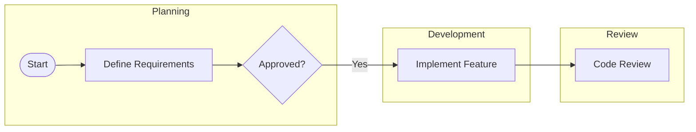

# 123

```mermaid
flowchart LR
  subgraph lane_8b13c969_89a7_4039_9dd5_6982b8306469["Planning"]
    t_67592002_ec2e_48ed_b469_cd5bd2b0ad52{"Approved?"}
    t_654e9a6f_e07d_4782_930c_d053f70fe3bc["Define Requirements"]
    t_f6e1fc8b_c409_4151_94bd_145265cb3c1a(["Start"])
  end
  subgraph lane_41de6d9e_72a4_4d48_b31d_1c7dd03c45d2["Development"]
    t_73d01946_60c2_4c33_9be7_82dd5f6c3e23["Implement Feature"]
  end
  subgraph lane_1215d087_31eb_418f_ab8e_8471b18aab1a["Review"]
    t_5105eef6_7c2e_49c4_87c4_24a004181962["Code Review"]
  end
  t_f6e1fc8b_c409_4151_94bd_145265cb3c1a --> t_654e9a6f_e07d_4782_930c_d053f70fe3bc
  t_654e9a6f_e07d_4782_930c_d053f70fe3bc --> t_67592002_ec2e_48ed_b469_cd5bd2b0ad52
  t_67592002_ec2e_48ed_b469_cd5bd2b0ad52 -->|"Yes"| t_73d01946_60c2_4c33_9be7_82dd5f6c3e23
  t_73d01946_60c2_4c33_9be7_82dd5f6c3e23 --> t_5105eef6_7c2e_49c4_87c4_24a004181962

```
