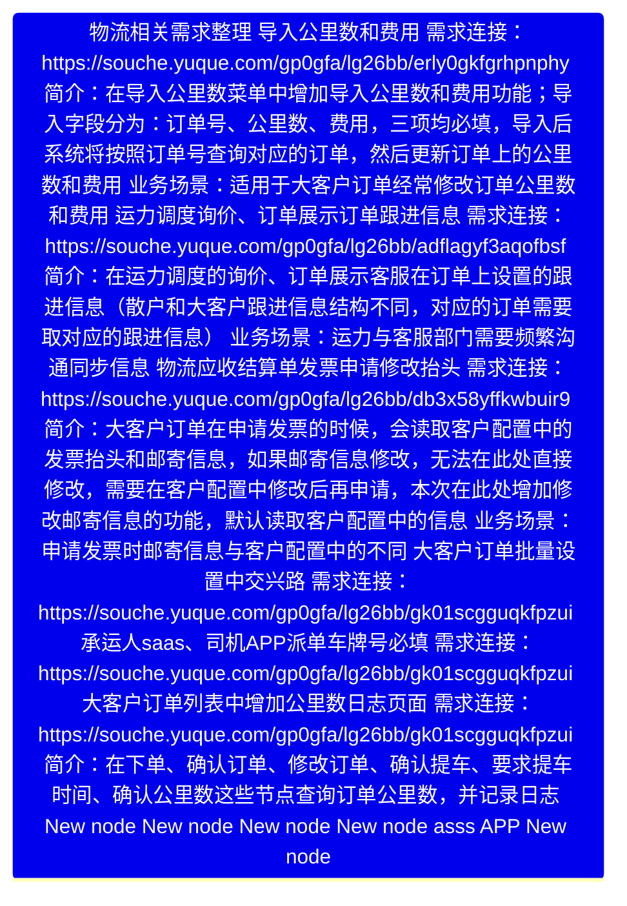

# 123

```mermaid
mindmap 物流相关需求整理 导入公里数和费用 需求连接：https://souche.yuque.com/gp0gfa/lg26bb/erly0gkfgrhpnphy 简介：在导入公里数菜单中增加导入公里数和费用功能；导入字段分为：订单号、公里数、费用，三项均必填，导入后系统将按照订单号查询对应的订单，然后更新订单上的公里数和费用 业务场景：适用于大客户订单经常修改订单公里数和费用 运力调度询价、订单展示订单跟进信息 需求连接：https://souche.yuque.com/gp0gfa/lg26bb/adflagyf3aqofbsf 简介：在运力调度的询价、订单展示客服在订单上设置的跟进信息（散户和大客户跟进信息结构不同，对应的订单需要取对应的跟进信息） 业务场景：运力与客服部门需要频繁沟通同步信息 物流应收结算单发票申请修改抬头 需求连接：https://souche.yuque.com/gp0gfa/lg26bb/db3x58yffkwbuir9 简介：大客户订单在申请发票的时候，会读取客户配置中的发票抬头和邮寄信息，如果邮寄信息修改，无法在此处直接修改，需要在客户配置中修改后再申请，本次在此处增加修改邮寄信息的功能，默认读取客户配置中的信息 业务场景：申请发票时邮寄信息与客户配置中的不同 大客户订单批量设置中交兴路 需求连接：https://souche.yuque.com/gp0gfa/lg26bb/gk01scgguqkfpzui 承运人saas、司机APP派单车牌号必填 需求连接：https://souche.yuque.com/gp0gfa/lg26bb/gk01scgguqkfpzui 大客户订单列表中增加公里数日志页面 需求连接：https://souche.yuque.com/gp0gfa/lg26bb/gk01scgguqkfpzui 简介：在下单、确认订单、修改订单、确认提车、要求提车时间、确认公里数这些节点查询订单公里数，并记录日志 New node New node New node New node asss APP New node

```
