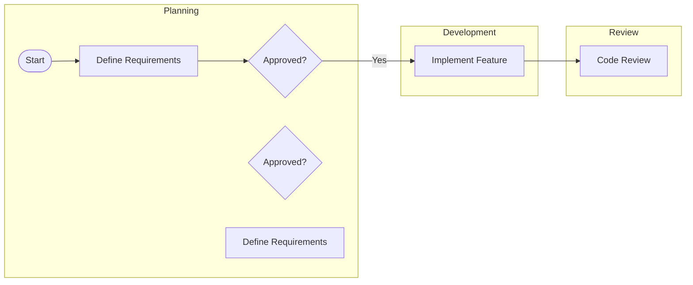

# 12

```mermaid
flowchart LR
  subgraph lane_0["Planning"]
    t_0{"Approved?"}
    t_1(["Start"])
    t_2["Define Requirements"]
    t_3{"Approved?"}
    t_4["Define Requirements"]
  end
  subgraph lane_1["Development"]
    t_5["Implement Feature"]
  end
  subgraph lane_2["Review"]
    t_6["Code Review"]
  end
  t_1 --> t_2
  t_2 --> t_0
  t_0 -->|"Yes"| t_5
  t_5 --> t_6

```
