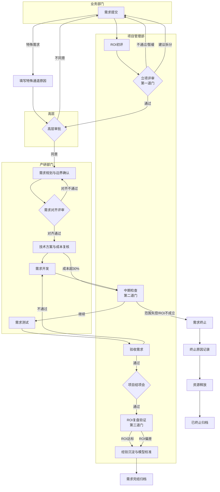

# Untitled

```mermaid
flowchart TD
    subgraph 业务部门
        A1[需求提交]
    end
    
    subgraph 项目管理部
        B1[ROI初评]
        B2{立项评审<br/>第一道门}
        B3[中期检查<br/>第二道门]
        B4[验收需求]
        B5{项目结项会}
        B6[ROI复盘验证<br/>第三道门]
        B7[经验沉淀与模型校准]
    end
    
    subgraph 产研部门
        C1[需求规划与边界确认]
        C2{需求对齐评审}
        C3[技术方案与成本复核]
        C4[需求开发]
        C5[需求测试]
    end
    
    subgraph 高层
        D1{高层审批}
    end
    
    %% 主流程
    A1 --> B1
    B1 --> B2
    B2 -->|通过| D1
    D1 -->|同意| C1
    D1 -->|不同意| A1
    B2 -->|不通过/暂缓| A1
    B2 -->|建议拆分| A1
    
    C1 --> C2
    C2 -->|对齐通过| C3
    C2 -->|对齐不通过| C1
    C3 --> C4
    C3 -->|成本超30%| B3
    
    C4 --> B3
    B3 -->|继续| C5
    B3 -->|范围失控/ROI不成立| T1[需求终止]
    
    C5 --> B4
    B4 -->|通过| B5
    B4 -->|不通过| C4
    
    B5 -->|通过| B6
    B6 -->|ROI达标| B7
    B6 -->|ROI偏差| B7
    B7 --> E1[需求完结归档]
    
    %% 终止机制
    T1 --> T2[终止原因记录]
    T2 --> T3[资源释放]
    T3 --> E2[已终止归档]
    
    %% 特殊通道
    A1 -->|特殊需求| S1[填写特殊通道原因]
    S1 --> D1
```
