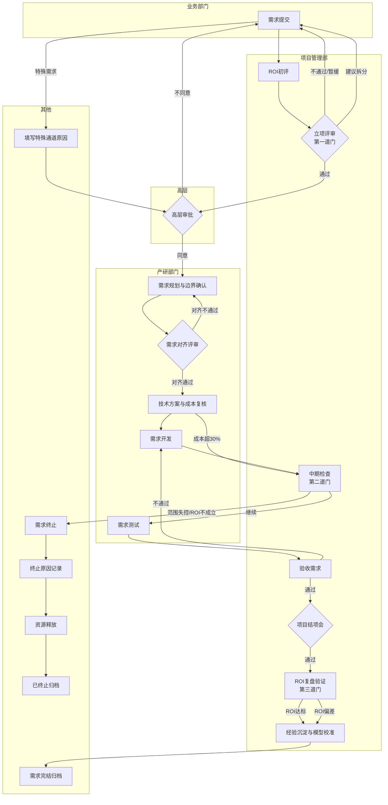

# Untitled

```mermaid
flowchart TD
  subgraph lane_0["业务部门"]
    t_0["需求提交"]
  end
  subgraph lane_1["项目管理部"]
    t_1["ROI初评"]
    t_2{"立项评审<br/>第一道门"}
    t_3["中期检查<br/>第二道门"]
    t_4["验收需求"]
    t_5{"项目结项会"}
    t_6["ROI复盘验证<br/>第三道门"]
    t_7["经验沉淀与模型校准"]
  end
  subgraph lane_2["产研部门"]
    t_8["需求测试"]
    t_9["需求规划与边界确认"]
    t_10{"需求对齐评审"}
    t_11["技术方案与成本复核"]
    t_12["需求开发"]
  end
  subgraph lane_3["高层"]
    t_13{"高层审批"}
  end
  subgraph lane_4["其他"]
    t_14["填写特殊通道原因"]
    t_15["需求终止"]
    t_16["终止原因记录"]
    t_17["资源释放"]
    t_18["已终止归档"]
    t_19["需求完结归档"]
  end
  t_0 --> t_1
  t_1 --> t_2
  t_2 -->|"通过"| t_13
  t_13 -->|"同意"| t_9
  t_13 -->|"不同意"| t_0
  t_2 -->|"不通过/暂缓"| t_0
  t_2 -->|"建议拆分"| t_0
  t_9 --> t_10
  t_10 -->|"对齐通过"| t_11
  t_10 -->|"对齐不通过"| t_9
  t_11 --> t_12
  t_11 -->|"成本超30%"| t_3
  t_12 --> t_3
  t_3 -->|"继续"| t_8
  t_3 -->|"范围失控/ROI不成立"| t_15
  t_8 --> t_4
  t_4 -->|"通过"| t_5
  t_4 -->|"不通过"| t_12
  t_5 -->|"通过"| t_6
  t_6 -->|"ROI达标"| t_7
  t_6 -->|"ROI偏差"| t_7
  t_7 --> t_19
  t_15 --> t_16
  t_16 --> t_17
  t_17 --> t_18
  t_0 -->|"特殊需求"| t_14
  t_14 --> t_13

```
