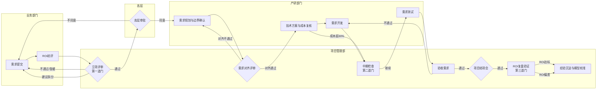

# Untitled

```mermaid
flowchart LR
  subgraph lane_0["业务部门"]
    t_0["需求提交"]
    t_1["ROI初评"]
  end
  subgraph lane_1["项目管理部"]
    t_2["中期检查<br/>第二道门"]
    t_3["验收需求"]
    t_4{"项目结项会"}
    t_5{"立项评审<br/>第一道门"}
    t_6{"需求对齐评审"}
    t_7["ROI复盘验证<br/>第三道门"]
    t_8["经验沉淀与模型校准"]
  end
  subgraph lane_2["产研部门"]
    t_9["技术方案与成本复核"]
    t_10["需求测试"]
    t_11["需求开发"]
    t_12["需求规划与边界确认"]
  end
  subgraph lane_3["高层"]
    t_13{"高层审批"}
  end
  t_0 --> t_1
  t_1 --> t_5
  t_5 -->|"通过"| t_13
  t_13 -->|"同意"| t_12
  t_13 -->|"不同意"| t_0
  t_5 -->|"不通过/暂缓"| t_0
  t_5 -->|"建议拆分"| t_0
  t_12 --> t_6
  t_6 -->|"对齐通过"| t_9
  t_6 -->|"对齐不通过"| t_12
  t_9 --> t_11
  t_9 -->|"成本超30%"| t_2
  t_11 --> t_2
  t_2 -->|"继续"| t_10
  t_10 --> t_3
  t_3 -->|"通过"| t_4
  t_3 -->|"不通过"| t_11
  t_4 -->|"通过"| t_7
  t_7 -->|"ROI达标"| t_8
  t_7 -->|"ROI偏差"| t_8

```
