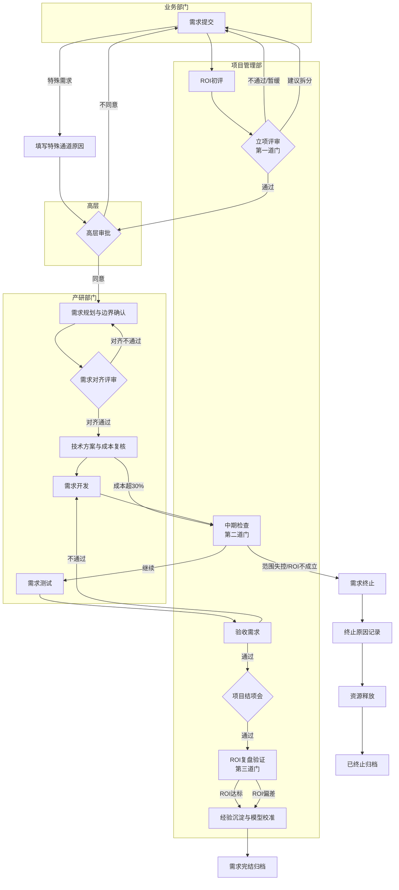

# Untitled

```mermaid
flowchart TD
  subgraph n_0 ["业务部门"]
    n_10["需求提交"]
  end
  subgraph n_1 ["项目管理部"]
    n_11["ROI初评"]
    n_12{"立项评审<br/>第一道门"}
    n_13["中期检查<br/>第二道门"]
    n_14["验收需求"]
    n_15{"项目结项会"}
    n_16["ROI复盘验证<br/>第三道门"]
    n_17["经验沉淀与模型校准"]
  end
  subgraph n_2 ["产研部门"]
    n_18["需求规划与边界确认"]
    n_19{"需求对齐评审"}
    n_20["技术方案与成本复核"]
    n_21["需求开发"]
    n_22["需求测试"]
  end
  subgraph n_3 ["高层"]
    n_23{"高层审批"}
  end
  n_4["需求终止"]
  n_5["需求完结归档"]
  n_6["终止原因记录"]
  n_7["资源释放"]
  n_8["已终止归档"]
  n_9["填写特殊通道原因"]
  n_10 --> n_11
  n_11 --> n_12
  n_12 -->|"通过"| n_23
  n_23 -->|"同意"| n_18
  n_23 -->|"不同意"| n_10
  n_12 -->|"不通过/暂缓"| n_10
  n_12 -->|"建议拆分"| n_10
  n_18 --> n_19
  n_19 -->|"对齐通过"| n_20
  n_19 -->|"对齐不通过"| n_18
  n_20 --> n_21
  n_20 -->|"成本超30%"| n_13
  n_21 --> n_13
  n_13 -->|"继续"| n_22
  n_13 -->|"范围失控/ROI不成立"| n_4
  n_22 --> n_14
  n_14 -->|"通过"| n_15
  n_14 -->|"不通过"| n_21
  n_15 -->|"通过"| n_16
  n_16 -->|"ROI达标"| n_17
  n_16 -->|"ROI偏差"| n_17
  n_17 --> n_5
  n_4 --> n_6
  n_6 --> n_7
  n_7 --> n_8
  n_10 -->|"特殊需求"| n_9
  n_9 --> n_23

```
