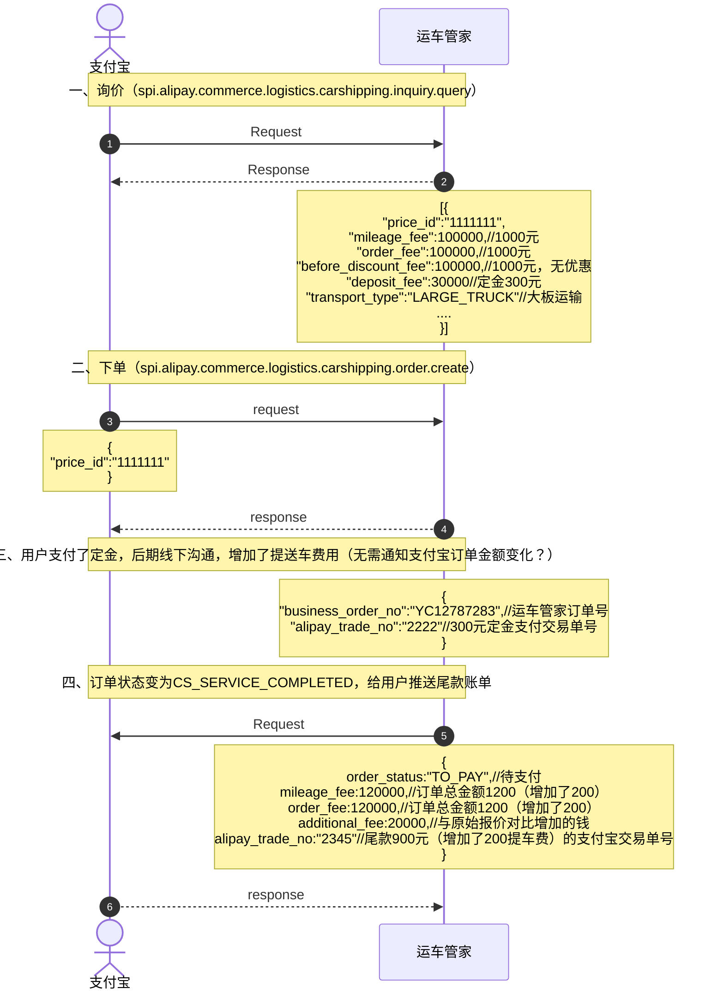

# Untitled

```mermaid
sequenceDiagram
  autonumber
  actor p0 as 支付宝
  participant p1 as 运车管家
  Note over p0,p1: 一、询价（spi.alipay.commerce.logistics.carshipping.inquiry.query）
  p0->>p1: Request
  p1-->>p0: Response
  %% [note-meta] align:left width:354.35999999999996
  Note over p1: [{<br/>	"price_id":"1111111",<br/>	"mileage_fee":100000,//1000元<br/>	"order_fee":100000,//1000元<br/>	"before_discount_fee":100000,//1000元，无优惠<br/>	"deposit_fee":30000//定金300元<br/>	"transport_type":"LARGE_TRUCK"//大板运输<br/>	....<br/>}]
  Note over p0,p1: 二、下单（spi.alipay.commerce.logistics.carshipping.order.create）
  p0->>p1: request
  Note over p0: {<br/>	"price_id":"1111111"<br/>}
  p1-->>p0: response
  Note over p0,p1: 三、用户支付了定金，后期线下沟通，增加了提送车费用（无需通知支付宝订单金额变化？）
  Note over p1: {<br/>	"business_order_no":"YC12787283",//运车管家订单号<br/>    "alipay_trade_no":"2222"//300元定金支付交易单号<br/>}
  Note over p0,p1: 四、订单状态变为CS_SERVICE_COMPLETED，给用户推送尾款账单
  p1->>p0: Request
  Note over p1: {<br/>	order_status:"TO_PAY",//待支付<br/>	mileage_fee:120000,//订单总金额1200（增加了200）<br/>	order_fee:120000,//订单总金额1200（增加了200）<br/>	additional_fee:20000,//与原始报价对比增加的钱<br/>	alipay_trade_no:"2345"//尾款900元（增加了200提车费）的支付宝交易单号<br/>}
  p0-->>p1: response

```
