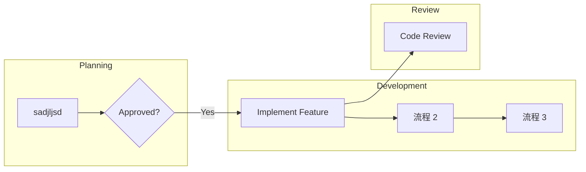

# ces

```mermaid
graph LR
  subgraph lane_lane_1["Planning"]
    t_task_1["sadjljsd"]
    t_task_2{"Approved?"}
  end
  subgraph lane_lane_2["Development"]
    t_task_3["Implement Feature"]
    t_ee3b1f36_3116_4843_a731_d0cd9bd1d084["流程 2"]
    t_c47c2f33_cb36_4504_94d8_065b69847a68["流程 3"]
  end
  subgraph lane_lane_3["Review"]
    t_task_4["Code Review"]
  end
  t_task_1 --> t_task_2
  t_task_2 -->|"Yes"| t_task_3
  t_task_3 --> t_task_4
  t_task_3 --> t_ee3b1f36_3116_4843_a731_d0cd9bd1d084
  t_ee3b1f36_3116_4843_a731_d0cd9bd1d084 --> t_c47c2f33_cb36_4504_94d8_065b69847a68

```
