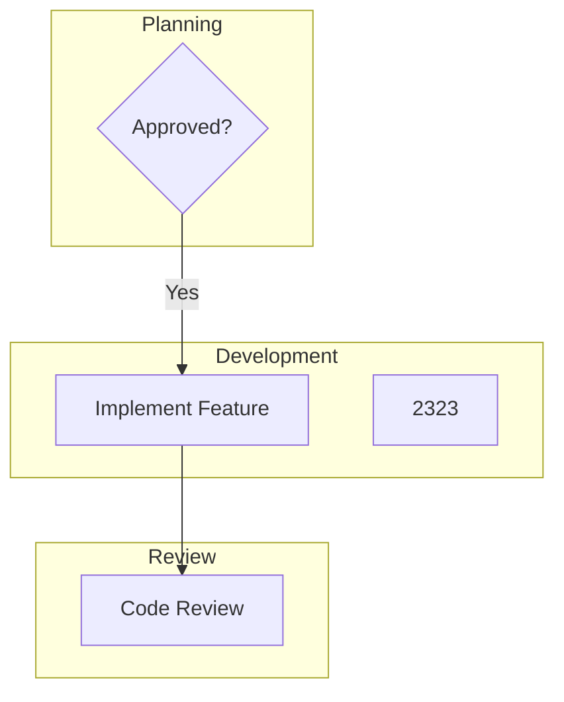

# test

```mermaid
graph TD
  subgraph lane_lane_1["Planning"]
    t_task_2{"Approved?"}
  end
  subgraph lane_lane_3["Review"]
    t_task_4["Code Review"]
  end
  subgraph lane_lane_2["Development"]
    t_task_3["Implement Feature"]
    t_43b12910_5a3e_485e_8185_afcefd1cbb3b["2323"]
  end
  t_task_2 -->|"Yes"| t_task_3
  t_task_3 --> t_task_4

```
