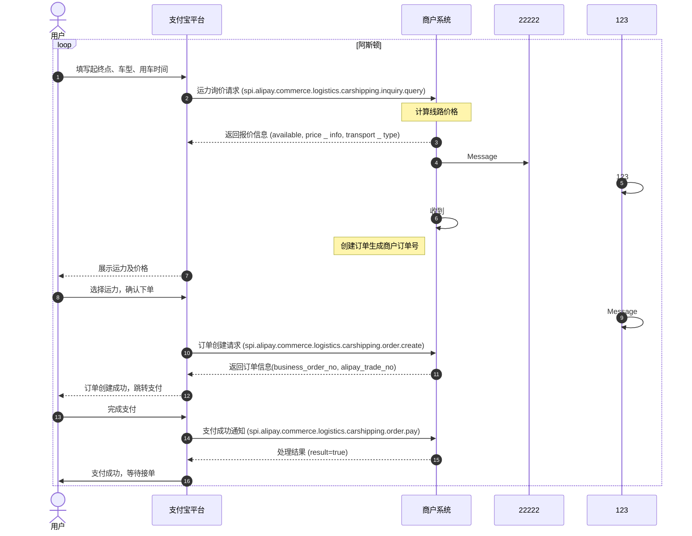

# test

```mermaid
sequenceDiagram
  autonumber
  actor p0 as 用户
  participant p1 as 支付宝平台
  participant p2 as 商户系统
  participant p3 as 22222
  participant p4 as 123
  loop 阿斯顿
  p0->>p1: 填写起终点、⻋型、⽤⻋时间
  p1->>p2: 运⼒询价请求 (spi.alipay.commerce.logistics.carshipping.inquiry.query)
  Note over p2: 计算线路价格
  p2-->>p1: 返回报价信息 (available, price _ info, transport _ type)
  p2->>p3: Message
  p4->>p4: 123
  p2->>p2: 收到
  Note left of p2: 创建订单⽣成商户订单号
  p1-->>p0: 展示运⼒及价格
  p0->>p1: 选择运⼒，确认下单
  p4->>p4: Message
  p1->>p2: 订单创建请求 (spi.alipay.commerce.logistics.carshipping.order.create)
  p2-->>p1: 返回订单信息(business_order_no, alipay_trade_no)
  p1-->>p0: 订单创建成功，跳转⽀付
  p0->>p1: 完成⽀付
  p1->>p2: ⽀付成功通知 (spi.alipay.commerce.logistics.carshipping.order.pay)
  p2-->>p1: 处理结果 (result=true)
  p1->>p0: ⽀付成功，等待接单
  end

```
