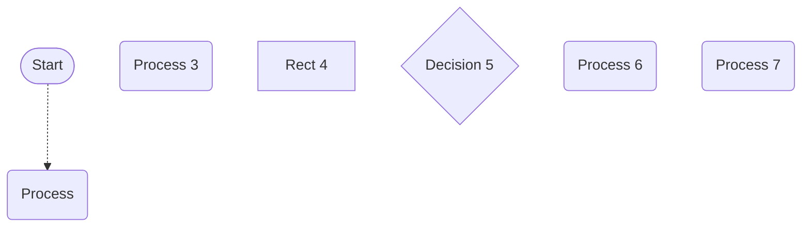

# test

```mermaid
flowchart TD
  start(["Start"])
  1("Process")
  8c6533b4-1491-42b6-8429-e5650ae68c24("Process 3")
  26a173d8-dfef-4098-b775-d7b68b075127["Rect 4"]
  e01af272-47a0-41ac-acff-df6d8777e188{"Decision 5"}
  f29fc584-bcde-434a-abf3-083829181fbd("Process 6")
  4d611947-662d-4947-896d-a6d85957e1b8("Process 7")
  start -.-> 1

```
