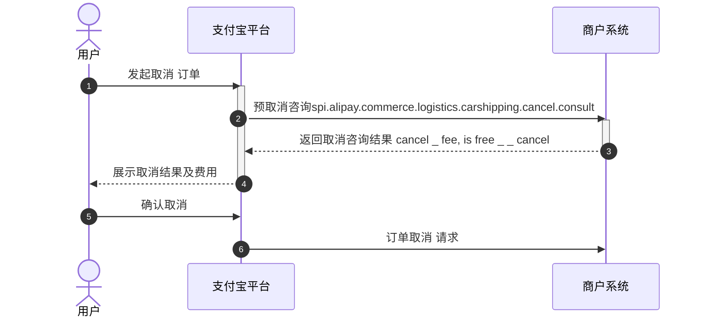

# 取消 订单时序

```mermaid
sequenceDiagram
  autonumber
  actor p0 as 用户
  participant p1 as 支付宝平台
  participant p2 as 商户系统
  p0->>p1: 发起取消 订单
  activate p1
  p1->>p2: 预取消咨询spi.alipay.commerce.logistics.carshipping.cancel.consult
  activate p2
  p2-->>p1: 返回取消咨询结果 cancel _ fee, is free _ _ cancel
  deactivate p2
  p1-->>p0: 展示取消结果及费⽤
  deactivate p1
  p0->>p1: 确认取消
  p1->>p2: 订单取消 请求

```
