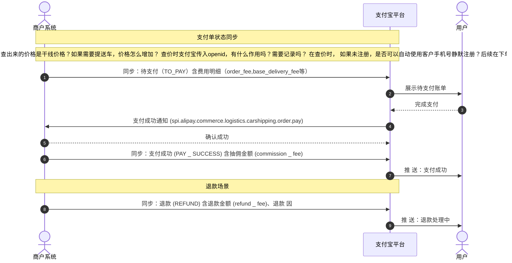

# 支付单状态同步时序

```mermaid
sequenceDiagram
  autonumber
  actor p0 as 商户系统
  participant p1 as ⽀付宝平台
  actor p2 as 用户
  Note over p0,p1: ⽀付单状态同步
  Note over p0,p1: 是否需要提车和送车在查价接口中没有参数，查出来的价格是干线价格？如果需要提送车，价格怎么增加？ 查价时支付宝传入openid，有什么作用吗？需要记录吗？ 在查价时， 如果未注册，是否可以自动使用客户手机号静默注册？后续在下单时就无需授权？
  p0->>p1: 同步：待支付（TO_PAY）含费用明细（order_fee,base_delivery_fee等）
  p1->>p2: 展示待⽀付账单
  p2-->>p1: 完成⽀付
  p1->>p0: ⽀付成功通知 (spi.alipay.commerce.logistics.carshipping.order.pay)
  p0-->>p1: 确认成功
  p0->>p1: 同步：⽀付成功 (PAY _ SUCCESS) 含抽佣⾦额 (commission _ fee)
  p1->>p2: 推 送：⽀付成功
  Note over p0,p1: 退款场景
  p0->>p1: 同步：退款 (REFUND) 含退款⾦额 (refund _ fee)、退款 因
  p1->>p2: 推 送：退款处理中

```
