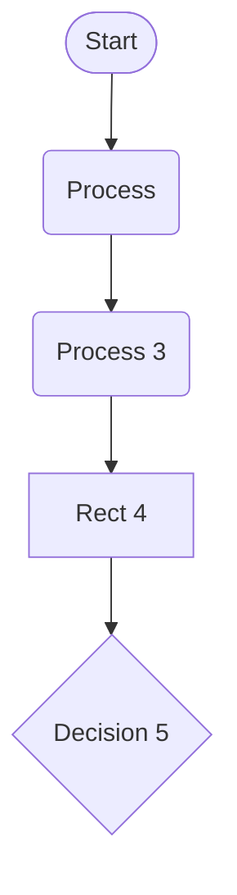

# 流程图1

```mermaid
flowchart TD
  start(["Start"])
  1("Process")
  c6c59789-c1c6-4f40-b71e-37e621c2905e("Process 3")
  e555e08a-bfc9-47f3-9a7f-eaa219d94710["Rect 4"]
  d900c80b-cacd-4d95-b9a7-b296318b0ecc{"Decision 5"}
  start --> 1
  1 --> c6c59789-c1c6-4f40-b71e-37e621c2905e
  c6c59789-c1c6-4f40-b71e-37e621c2905e --> e555e08a-bfc9-47f3-9a7f-eaa219d94710
  e555e08a-bfc9-47f3-9a7f-eaa219d94710 --> d900c80b-cacd-4d95-b9a7-b296318b0ecc

```
