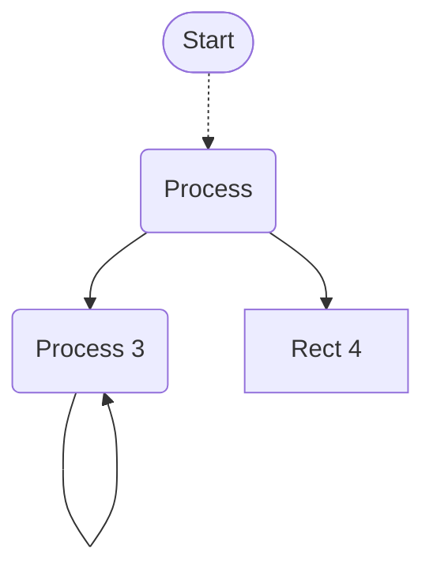

# 流程图

```mermaid
graph TD
  start(["Start"])
  1("Process")
  2b55b8de-e64f-48f1-a8b6-94cca48b33d2("Process 3")
  f836676b-fb2c-4936-a911-d066d325c8e0["Rect 4"]
  start -.-> 1
  2b55b8de-e64f-48f1-a8b6-94cca48b33d2 --> 2b55b8de-e64f-48f1-a8b6-94cca48b33d2
  1 --> 2b55b8de-e64f-48f1-a8b6-94cca48b33d2
  1 --> f836676b-fb2c-4936-a911-d066d325c8e0

```
