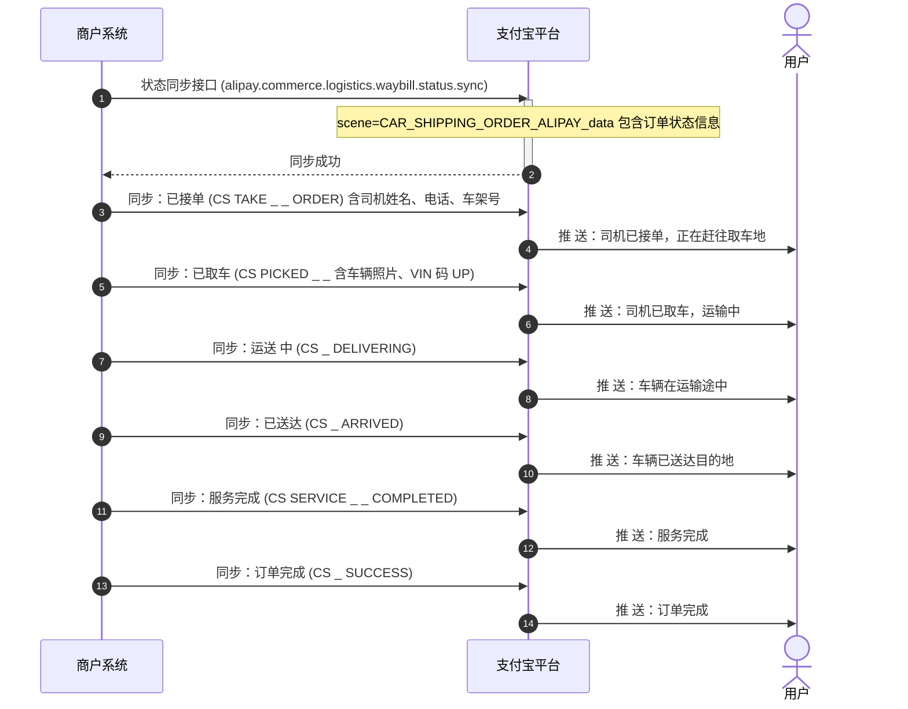

# 订单状态同步时序

```mermaid
sequenceDiagram
  autonumber
  participant p0 as 商户系统
  participant p1 as 支付宝平台
  actor p2 as 用户
  p0->>p1: 状态同步接⼝ (alipay.commerce.logistics.waybill.status.sync)
  activate p1
  Note over p1: scene=CAR_SHIPPING_ORDER_ALIPAY_data 包含订单状态信息
  p1-->>p0: 同步成功
  deactivate p1
  p0->>p1: 同步：已接单 (CS TAKE _ _ ORDER) 含司机姓名、电话、⻋架号
  p1->>p2: 推 送：司机已接单，正在赶往取⻋地
  p0->>p1: 同步：已取⻋ (CS PICKED _ _ 含⻋辆照⽚、VIN 码 UP)
  p1->>p2: 推 送：司机已取⻋，运输中
  p0->>p1: 同步：运送 中 (CS _ DELIVERING)
  p1->>p2: 推 送：⻋辆在运输途中
  p0->>p1: 同步：已送达 (CS _ ARRIVED)
  p1->>p2: 推 送：⻋辆已送达⽬的地
  p0->>p1: 同步：服务完成 (CS SERVICE _ _ COMPLETED)
  p1->>p2: 推 送：服务完成
  p0->>p1: 同步：订单完成 (CS _ SUCCESS)
  p1->>p2: 推 送：订单完成

```
