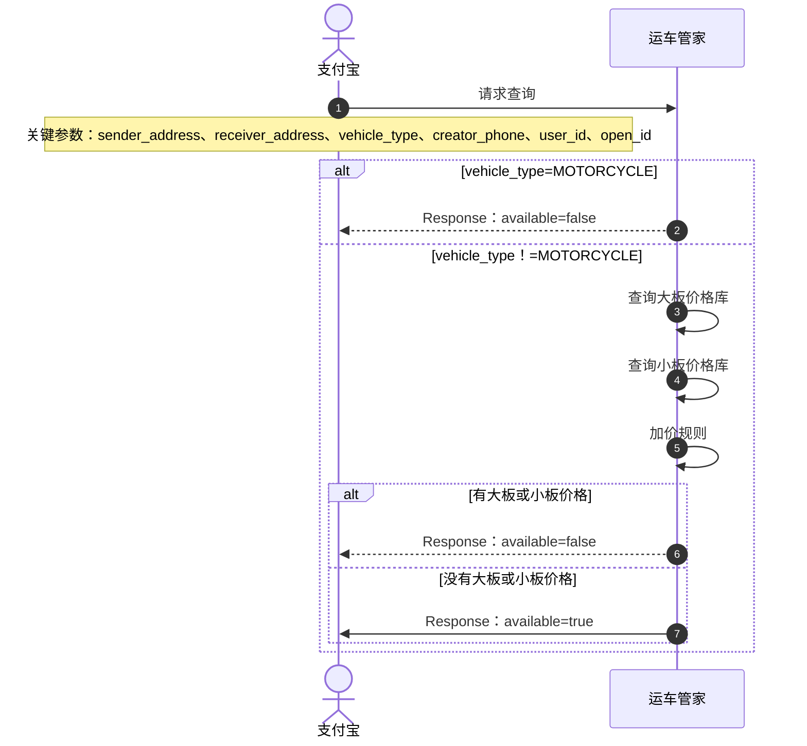

# 运价查询接口

```mermaid
sequenceDiagram
  autonumber
  actor p0 as 支付宝
  participant p1 as 运车管家
  p0->>p1: 请求查询
  Note over p0: 关键参数：sender_address、receiver_address、vehicle_type、creator_phone、user_id、open_id
  alt vehicle_type=MOTORCYCLE
  p1-->>p0: Response：available=false
  else vehicle_type！=MOTORCYCLE
  p1->>p1: 查询大板价格库
  p1->>p1: 查询小板价格库
  p1->>p1: 加价规则
  alt 有大板或小板价格
  p1-->>p0: Response：available=false
  else 没有大板或小板价格
  p1->>p0: Response：available=true
  end
  end

```
